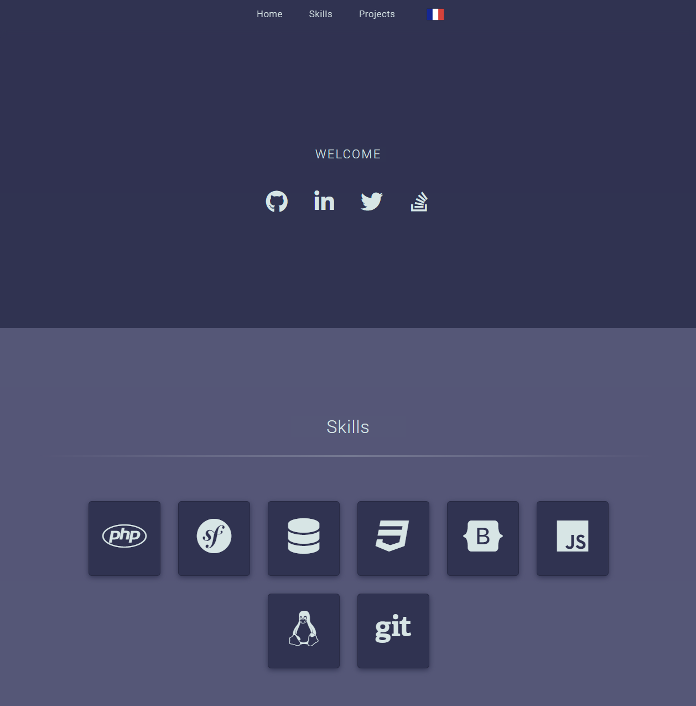

# Portfolio (Archive)

Single webpage to show projects.

Project build to practice front technologies, a first version of this website was made with only
CSS and media queries before using Bootstrap 5. A translation is enabled by using the DOM with JavaScript.

### Features

- Translation in French or English based on the navigator language.
- Use Gulp to optimize styles, scripts and images.

### Technologies

- HTML 5
- CSS 3
- JavaScript ES6
- Bootstrap 5.2
- FontAwesome 6.1
- Gulp 4.0

### Visuals



## Installation

### Requirements

- Node.js 12.0+ with npm
- Gulp 4.0+ (optional)
- Docker & Docker Compose 3.8+ (optional)

### Manual installation

Clone the repository :

```bash
git clone https://github.com/kserbouty/portfolio-archive.git
```

Switch to the repository folder :

```bash
cd portfolio-archive
```

Install the dependencies with npm :

```bash
npm install
```

Run public/index.html in your browser.

### Docker installation

To run with Docker, follow these commands :

```bash
git clone https://github.com/kserbouty/portfolio-archive.git
cd portfolio-bootstrap
docker compose up -d --build
```  

Ports set for <http://localhost:8000>.

## Usage

### Optimize resources

Install [gulp-cli](https://www.npmjs.com/package/gulp-cli) globally :

```bash
npm install --global gulp-cli
```

Run the gulp script :

```bash
gulp
```

Uninstall [gulp-cli](https://www.npmjs.com/package/gulp-cli) globally if not needed anymore :

```bash
npm uninstall --global gulp-cli
```

## License

[MIT](./LICENSE.md)

## Project status

*Canceled*
